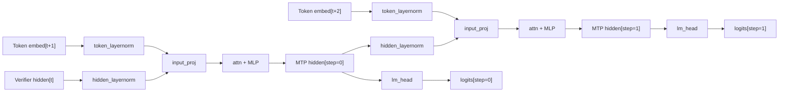

# FastMTP (Multi-Token Prediction)

FastMTP is a speculative decoding algorithm introduced by TencentBAC that accelerates LLM inference by predicting multiple future tokens per forward pass using a single MTP (Multi-Token Prediction) layer applied recursively.

!!! note "Status" FastMTP support is under active development. The model definition and converter are being integrated on feature branches. This documentation reflects the target design and will be updated as components land on `main`.

**Paper:** Cai et al., [FastMTP: Accelerating LLM Inference with Enhanced Multi-Token Prediction](https://arxiv.org/abs/2509.18362), arXiv:2509.18362, 2025.

## Architecture Overview

FastMTP uses a single MTP layer that is applied recursively across prediction steps. At each step $k$, the layer receives:

1. **Token embedding** for `input_ids[t+k+1]` (the ground-truth next token)
2. **Hidden state** from step $k-1$ (or the verifier's hidden state for step 0)

Each step predicts token $t+k+2$.



### Key Components

| Component          | Description                                                                                 |
| ------------------ | ------------------------------------------------------------------------------------------- |
| `hidden_layernorm` | RMSNorm applied to incoming hidden states                                                   |
| `token_layernorm`  | RMSNorm applied to token embeddings                                                         |
| `input_proj`       | Linear projection that fuses hidden states and embeddings (`2 * hidden_size → hidden_size`) |
| `attn + MLP`       | Standard transformer decoder layer (reuses verifier architecture)                           |
| `final_layernorm`  | RMSNorm on MTP layer output                                                                 |
| `embed_tokens`     | Shared with verifier (frozen during training)                                               |
| `lm_head`          | Shared with verifier (frozen during training)                                               |

### Supported Checkpoints

| Model                                                                 | `model_type`     | Architecture      |
| --------------------------------------------------------------------- | ---------------- | ----------------- |
| [Qwen3-Next](https://huggingface.co/Qwen/Qwen3-Next-80B-A3B-Instruct) | `qwen3_next`     | Sparse MoE        |
| MiMo (TencentBAC/FastMTP)                                             | `mimo` / `qwen2` | Qwen2-based dense |

## Training Guide

### Training Objective

FastMTP uses a weighted multi-step cross-entropy loss:

$$\\mathcal{L}_{\\text{mtp}} = \\sum_{k=0}^{K-1} \\alpha_k \\cdot \\text{CE}(\\text{logits}_k,\\ \\text{tokens}_{t+k+2})$$

Default step weights use exponential decay ($\\beta = 0.6$, normalized): $\\alpha = [0.51, 0.31, 0.18]$ for $K = 3$ steps. Loss is computed only on response tokens via a `loss_mask`.

### Data Generation

FastMTP training requires hidden states from the verifier model. Use the standard Speculators offline data generation pipeline:

```bash
python scripts/data_generation_offline.py \
    --model-name Qwen/Qwen3-Next-80B-A3B-Instruct \
    --dataset HuggingFaceH4/ultrachat_200k \
    --output-dir ./data/fast_mtp \
    --tensor-parallel-size 4
```

### Training

Once data is generated, train the FastMTP head:

```bash
torchrun --nnodes=1 --nproc_per_node=8 scripts/train.py \
    --speculator-type mtp \
    --verifier-name-or-path Qwen/Qwen3-Next-80B-A3B-Instruct \
    --data-path ./data/fast_mtp \
    --save-path ./checkpoints/fast_mtp \
    --epochs 20 \
    --num-layers 1
```

### Configuration Reference

Key configuration fields in `FastMTPConfig`:

| Parameter                  | Type               | Default       | Description                                                 |
| -------------------------- | ------------------ | ------------- | ----------------------------------------------------------- |
| `speculators_model_type`   | `str`              | `"mtp"`       | Algorithm identifier for registry lookup                    |
| `transformer_layer_config` | `PretrainedConfig` | `Qwen2Config` | Underlying transformer architecture config                  |
| `num_nextn_predict_layers` | `int`              | `1`           | Number of MTP prediction heads (currently only 1 supported) |

Derived properties (not stored, computed at runtime):

| Property                | Source                                                      | Description                |
| ----------------------- | ----------------------------------------------------------- | -------------------------- |
| `hidden_size`           | `transformer_layer_config.hidden_size`                      | Hidden dimension           |
| `vocab_size`            | `transformer_layer_config.vocab_size`                       | Vocabulary size            |
| `num_speculative_steps` | `speculators_config.proposal_methods[0].speculative_tokens` | Number of prediction steps |

## Inference Guide

### vLLM Deployment

Models trained through Speculators can be served directly with vLLM:

```bash
vllm serve <path-to-fast-mtp-checkpoint>
```

vLLM reads the `speculators_config` from the model's `config.json` and automatically sets up both the speculator and verifier for speculative decoding.

### Programmatic Usage

```python
from speculators import SpeculatorModelConfig

# Load a FastMTP config
config = SpeculatorModelConfig.from_pretrained("path/to/fast_mtp_checkpoint")
print(config.speculators_model_type)  # "mtp"
print(config.vocab_size)              # derived from transformer_layer_config
print(config.hidden_size)             # derived from transformer_layer_config
```

## Benchmarking

### Using GuideLLM

After deploying a FastMTP model with vLLM, benchmark it using [GuideLLM](https://github.com/vllm-project/guidellm):

```bash
# Start vLLM server with the speculator
vllm serve <path-to-fast-mtp-checkpoint> --port 8000

# Run GuideLLM benchmark
guidellm benchmark \
    --target http://localhost:8000 \
    --model <path-to-fast-mtp-checkpoint> \
    --dataset openai/humaneval
```

See the [GuideLLM evaluation example](../examples/eval-guidellm.md) for detailed instructions.

### Key Metrics

When evaluating FastMTP performance, focus on:

| Metric                    | Description                                         | How to Measure               |
| ------------------------- | --------------------------------------------------- | ---------------------------- |
| **Acceptance rate**       | Fraction of drafted tokens accepted by the verifier | vLLM logs or GuideLLM output |
| **Latency (TTFT)**        | Time to first token                                 | GuideLLM benchmark           |
| **Throughput (tokens/s)** | End-to-end generation throughput                    | GuideLLM benchmark           |
| **Memory overhead**       | Additional GPU memory used by the speculator        | `nvidia-smi` during serving  |

### Expected Performance

Based on the [FastMTP paper](https://arxiv.org/abs/2509.18362) (Section 4):

- **2–3× speedup** over standard autoregressive decoding on supported models
- Minimal memory overhead due to single-layer recursive design
- Higher acceptance rates on structured/predictable content

## References

```bibtex
@article{cai2025fastmtp,
  title={FastMTP: Accelerating LLM Inference with Enhanced Multi-Token Prediction},
  author={Cai, Yuxuan and Liang, Xiaozhuan and Wang, Xinghua and Ma, Jin
          and Liang, Haijin and Luo, Jinwen and Zuo, Xinyu and Duan, Lisheng
          and Yin, Yuyang and Chen, Xi},
  journal={arXiv preprint arXiv:2509.18362},
  year={2025}
}
```
