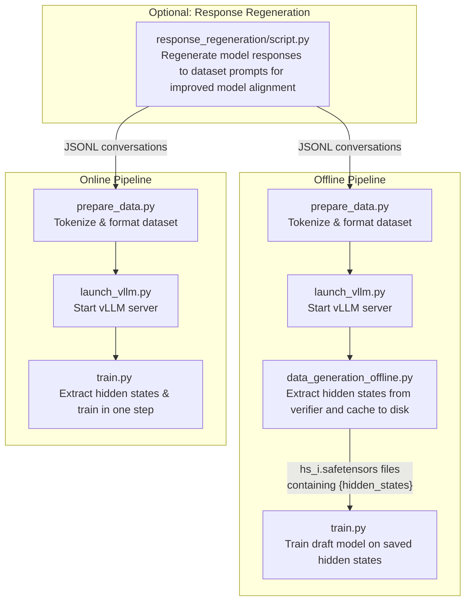

# CLI Reference

This page provides a comprehensive reference for all command-line interface (CLI) tools available in Speculators.

## Overview

Speculators provides four main CLI scripts for different stages of the speculative decoding workflow:

| Script                       | Purpose                                                      | Reference                               |
| ---------------------------- | ------------------------------------------------------------ | --------------------------------------- |
| `prepare_data.py`            | Preprocess and tokenize datasets for training                | [→ Details](prepare_data.md)            |
| `data_generation_offline.py` | Generate hidden states offline using vLLM                    | [→ Details](data_generation_offline.md) |
| `launch_vllm.py`             | Launch vLLM server configured for hidden states extraction   | [→ Details](launch_vllm.md)             |
| `train.py`                   | Train speculator models with online or offline hidden states | [→ Details](train.md)                   |

## Common Workflows

The diagram below shows the high-level flow for training a speculator model. The offline pipeline runs each stage sequentially, while the online pipeline combines hidden-state extraction and training into a single step.

