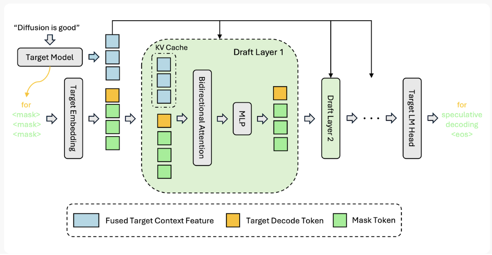

# DFlash

DFlash is a speculative decoding method that uses a small diffusion-LLM draft model to predict an entire block of tokens in a single forward pass, conditioned on hidden states from the target model. Unlike Eagle-3's autoregressive drafting, DFlash uses a non-causal attention mask so that each query attends to both the verifier's hidden states and mask token embeddings simultaneously, producing all draft tokens at once. This block-parallel approach can yield 2--3x larger speedups than Eagle-3 on synchronous requests. The draft model uses Qwen3-style transformer layers but can be paired with any supported verifier.

## How It Works

### Architecture



The target model produces hidden states (fused target context features) and decode tokens from the input sequence. These are combined with mask token embeddings and fed through a stack of draft layers, each consisting of bidirectional attention (with KV cache) and an MLP. The draft layers process context features and mask tokens together in a single forward pass. The output is projected through the target LM head to produce vocabulary logits for speculative decoding.

### Anchor Point Mechanism

1. **Select anchors:** Choose positions in the sequence
2. **Predict from anchors:** Generate a block of tokens from each anchor in a single forward pass
3. **Verify blocks:** Target model verifies the predicted blocks
4. **Accept valid tokens:** Use the longest valid prefix

### Sample From Anchor

DFlash supports two sampling modes controlled by the `sample_from_anchor` config field:

- **`False` (default for DFlash)**: Anchor is the bonus token, only mask tokens predict. Slot 0 is not trained. Produces `block_size - 1` speculative tokens.

- **`True` (default for [DSpark](dspark.md))**: Sample from anchor and all mask positions. All slots predict future tokens and are trained. Produces `block_size` speculative tokens. This matches the approach from the [DSpark paper](https://arxiv.org/abs/2607.05147).

The sampling mode affects both training (which targets are used and which slots are masked) and inference (how predictions are harvested from draft model outputs). When deploying to inference engines, ensure the engine's `sample_from_anchor` setting matches your model's config.

**Training:** Use the `--sample-from-anchor` / `--no-sample-from-anchor` flags to override the algorithm-specific default.

## Pretrained Models

Pretrained DFlash speculator models are available on HuggingFace from the [RedHatAI speculator models collection](https://huggingface.co/collections/RedHatAI/speculator-models):

| Verifier                | Speculator                                                                                                      |
| ----------------------- | --------------------------------------------------------------------------------------------------------------- |
| `google/gemma-4-31B-it` | [`RedHatAI/gemma-4-31B-it-speculator.dflash`](https://huggingface.co/RedHatAI/gemma-4-31B-it-speculator.dflash) |

> **Note:** DFlash is under active development. Not all hardware configurations have been validated yet — refer to individual model cards for details.

## Research & Citation

DFlash is based on research from Z Lab: [DFlash Project Page](https://z-lab.ai/projects/dflash/) | [arXiv Paper](https://arxiv.org/abs/2602.06036)

```bibtex
@article{chen2026dflash,
  title={DFlash: Block Diffusion for Flash Speculative Decoding},
  author={Chen, Jian and Liang, Yesheng and Liu, Zhijian},
  journal={arXiv preprint arXiv:2602.06036},
  year={2026}
}
```

## See Also

- [DSpark](dspark.md) -- Builds on DFlash with a sequential Markov head and a confidence head
- [Train a Speculator](../tutorials/train.md) -- Step-by-step training guide (select DFlash or DSpark, then online, offline, or hybrid)
