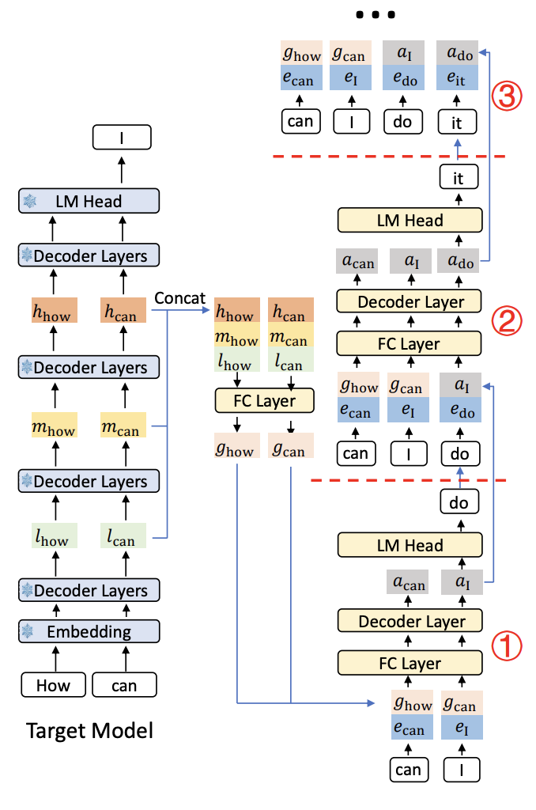

# EAGLE-3

EAGLE-3 is a speculative decoding algorithm that uses a lightweight draft model to autoregressively predict multiple tokens ahead, which are then verified by the target model in a single forward pass. The draft model uses Llama-style transformer layers and is trained to minimize KL divergence against the target model's logits. It supports cross-tokenizer vocabularies and can be paired with any supported verifier model.

## How It Works

### Architecture



The target model produces hidden states at selected layers, which are concatenated and projected through an FC layer alongside token embeddings. These pass through Llama-style decoder layers (default: 1) and an LM head to produce draft logits. At each autoregressive step, the draft model takes the previous token's embedding and hidden states to predict the next token.

### Inference Process

1. EAGLE-3 autoregressively drafts K tokens, each step feeding the previous prediction back through the draft model
2. Target model verifies all K draft tokens in one forward pass
3. The longest correct prefix is accepted
4. Repeat from the last accepted token

## Pretrained Models

Pretrained EAGLE-3 speculator models are available on HuggingFace from the [RedHatAI speculator models collection](https://huggingface.co/collections/RedHatAI/speculator-models):

| Verifier                                        | Speculator                                                                                                                                              |
| ----------------------------------------------- | ------------------------------------------------------------------------------------------------------------------------------------------------------- |
| `meta-llama/Llama-3.1-8B-Instruct`              | [`RedHatAI/Llama-3.1-8B-Instruct-speculator.eagle3`](https://huggingface.co/RedHatAI/Llama-3.1-8B-Instruct-speculator.eagle3)                           |
| `meta-llama/Llama-3.3-70B-Instruct`             | [`RedHatAI/Llama-3.3-70B-Instruct-speculator.eagle3`](https://huggingface.co/RedHatAI/Llama-3.3-70B-Instruct-speculator.eagle3)                         |
| `Qwen/Qwen3-8B`                                 | [`RedHatAI/Qwen3-8B-speculator.eagle3`](https://huggingface.co/RedHatAI/Qwen3-8B-speculator.eagle3)                                                     |
| `Qwen/Qwen3-14B`                                | [`RedHatAI/Qwen3-14B-speculator.eagle3`](https://huggingface.co/RedHatAI/Qwen3-14B-speculator.eagle3)                                                   |
| `Qwen/Qwen3-32B`                                | [`RedHatAI/Qwen3-32B-speculator.eagle3`](https://huggingface.co/RedHatAI/Qwen3-32B-speculator.eagle3)                                                   |
| `Qwen/Qwen3-235B-A22B`                          | [`RedHatAI/Qwen3-235B-A22B-speculator.eagle3`](https://huggingface.co/RedHatAI/Qwen3-235B-A22B-speculator.eagle3)                                       |
| `meta-llama/Llama-4-Maverick-17B-128E-Instruct` | [`RedHatAI/Llama-4-Maverick-17B-128E-Instruct-speculator.eagle3`](https://huggingface.co/RedHatAI/Llama-4-Maverick-17B-128E-Instruct-speculator.eagle3) |
| `google/gemma-4-31B-it`                         | [`RedHatAI/gemma-4-31B-it-speculator.eagle3`](https://huggingface.co/RedHatAI/gemma-4-31B-it-speculator.eagle3)                                         |

## Research & Citation

EAGLE-3 is based on research from SafeAI Lab: [EAGLE Repository](https://github.com/SafeAILab/EAGLE) | [arXiv Paper](https://arxiv.org/abs/2401.15077)

```bibtex
@article{li2024eagle,
  title={EAGLE: Speculative Sampling Requires Rethinking Feature Uncertainty},
  author={Li, Yuhui and Wei, Fangyun and Zhang, Chao and Zhang, Hongyang},
  journal={arXiv preprint arXiv:2401.15077},
  year={2024}
}
```

## See Also

- [Train EAGLE-3 Online](../tutorials/train_eagle3_online.md) -- Online training tutorial
- [Train EAGLE-3 Offline](../tutorials/train_eagle3_offline.md) -- Offline training tutorial
