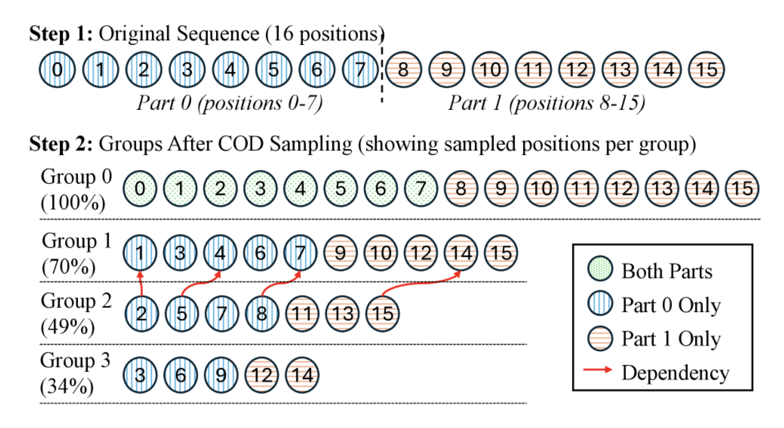

# P-EAGLE

P-EAGLE (Parallel EAGLE) extends Eagle-3 with parallel multi-token prediction. Instead of drafting tokens autoregressively one at a time, P-EAGLE predicts multiple tokens in parallel. It uses Conditional Drop-token (COD) sampling during training for memory efficiency, and Llama-style transformer layers inherited from Eagle-3. It can be paired with any supported verifier model.

## How It Works

### Architecture

P-EAGLE builds on the Eagle-3 architecture: the target model produces hidden states at selected layers, which are concatenated, projected, and passed through Llama-style decoder layers. The key difference is that P-EAGLE adds **multiple prediction depths** -- at each position, the model predicts not just the next token but several tokens ahead in parallel. Each depth level d makes predictions for position (anchor + d) in the sequence.

### COD Sampling



Training a parallel multi-depth model naively would require memory proportional to `num_depths × sequence_length`. P-EAGLE uses **Conditional Drop-token (COD) sampling** to reduce this cost:

- Depth 0 retains all n positions
- Depth d retains approximately n × r^d positions, where r is the `down-sample-ratio`
- A minimum retention floor (`down-sample-ratio-min`) prevents over-sampling at deep levels

This geometric decay means deeper predictions train on fewer positions per batch, keeping memory usage manageable while still learning to predict multiple tokens ahead.

### Inference Process

1. P-EAGLE drafts multiple tokens in parallel across all depths in a single pass
2. Target model verifies all draft tokens in one forward pass
3. The longest correct prefix is accepted
4. Repeat from the last accepted token

## Key Parameters

| Parameter | Default | Description | | --------------------------- | ------- | ------------------------------------------------- | | `--num-layers` | 4 | Number of draft transformer layers | | `--num-depths` | 4 | Number of parallel prediction depths | | `--down-sample-ratio` | 0.7 | Geometric decay ratio for COD sampling | | `--down-sample-ratio-min` | 0.2 | Minimum retention floor for COD sampling | | `--no-norm-before-residual` | — | Disable normalization before residual connections |

## Pretrained Models

There are currently no pretrained P-EAGLE models available. You can train your own using the tutorials linked below.

## Research & Citation

P-EAGLE is based on research from AWS AI Labs: [arXiv Paper](https://arxiv.org/abs/2602.01469)

```bibtex
@article{hui2026peagle,
  title={P-EAGLE: Parallel-Drafting EAGLE with Scalable Training},
  author={Hui, Mude and Huang, Xin and Salas, Jaime Campos and Sun, Yue and Pemberton, Nathan and Song, Xiang and Khetan, Ashish and Karypis, George},
  journal={arXiv preprint arXiv:2602.01469},
  year={2026}
}
```

## See Also

- [Train P-EAGLE Offline](../tutorials/train_peagle_offline.md) -- Offline training tutorial
