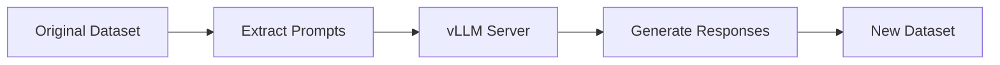

# Response Regeneration

Response regeneration is a powerful feature that improves training data quality by replacing original assistant responses with freshly generated responses from your target model. This ensures that the training data matches the style, knowledge, and capabilities of the model you're training a speculator for.

## Overview

When training a speculator, the quality of your training data directly impacts the model's performance. Response regeneration addresses several common issues with existing datasets:

- **Inconsistent quality:** Original responses may come from weaker models or human annotations with varying quality
- **Style mismatch:** The target model may have a different response style than the dataset's original responses
- **Updated knowledge:** Newer models may have better knowledge or capabilities than when the dataset was created
- **Off-policy training:** Training on regenerated responses allows using off-policy tokens for better performance

## How It Works

The response regeneration pipeline:

1. **Extract user prompts** from an existing conversational dataset
2. **Send prompts to vLLM server** running your target model
3. **Generate fresh responses** using the target model
4. **Save prompt-response pairs** in a new dataset ready for training



## Supported Datasets

The pipeline currently supports the following popular datasets:

- **Magpie** - High-quality instruction-following dataset
- **UltraChat** - Large-scale conversational dataset

Custom datasets can be added by implementing a dataset loader following the existing format.

## Usage

### Quick Start with `run_all.sh`

The easiest way to regenerate responses is using the all-in-one script:

```bash
cd scripts/response_regeneration

# Basic usage - regenerate Magpie dataset
./run_all.sh --model "meta-llama/Llama-3.3-70B-Instruct" --dataset magpie

# Process with limit
./run_all.sh --model "Qwen/Qwen2.5-72B-Instruct" --dataset ultrachat --limit 5000

# Use multiple GPUs with data parallelism (4 replicas)
./run_all.sh --model "Qwen/Qwen2.5-72B-Instruct" --dp-size 4 --dataset magpie

# Use tensor parallelism for large models
./run_all.sh --model "meta-llama/Llama-3.3-70B-Instruct" --tp-size 8 --dataset ultrachat
```

This script automatically:

1. Starts a vLLM server with the specified model
2. Runs the regeneration pipeline
3. Stops the server when complete (unless `--keep-server` is used)

### Manual Process

For more control, you can run each step separately:

#### Step 1: Start vLLM Server

```bash
# Start server with data parallelism (4 GPUs)
vllm serve "meta-llama/Llama-3.3-70B-Instruct" \
  --data-parallel-size 4 \
  --port 8000
```

#### Step 2: Run Regeneration Script

```bash
python script.py \
  --dataset magpie \
  --limit 5000 \
  --concurrency 128 \
  --max-tokens 4096 \
  --outfile magpie_llama33_70b.jsonl
```

The script will:

- Auto-detect the model from the vLLM server
- Extract prompts from the dataset
- Generate responses asynchronously
- Save results to the output file

## Key Arguments

### `run_all.sh` Arguments

- `--model` - HuggingFace model to serve (required)
- `--dataset` - Dataset to process: `magpie` or `ultrachat`
- `--limit` - Maximum number of samples to process
- `--gpus` - Comma-separated GPU IDs (e.g., `0,1,2,3`)
- `--dp-size` - Number of data-parallel replicas
- `--tp-size` - Tensor-parallel size per replica
- `--port` - Server port (default: 8000)
- `--keep-server` - Keep vLLM server running after completion
- `--concurrency` - Maximum concurrent requests (default: 64)
- `--max-tokens` - Max tokens per generation (default: 8192)

### `script.py` Arguments

- `--dataset` - Choose `magpie` or `ultrachat`
- `--endpoint` - vLLM chat completions endpoint
- `--limit` - Stop after N rows
- `--concurrency` - Max concurrent requests (default: 64)
- `--max-tokens` - Max generation tokens (default: 8192)
- `--outfile` - Output JSONL filename
- `--resume` - Skip already-processed rows
- `--language-filter` - Filter by language (e.g., `EN`)

## Performance Optimization

### Data Parallelism

For maximum throughput on multi-GPU systems, use data parallelism:

```bash
# 4 data-parallel replicas with TP=2 each (8 GPUs total)
./run_all.sh --model "Qwen/Qwen2.5-72B-Instruct" \
  --dp-size 4 \
  --tp-size 2 \
  --dataset magpie \
  --concurrency 256
```

Benefits:

- Automatic load balancing across GPUs
- Linear scaling with number of replicas
- No code changes required

### Concurrency Tuning

Adjust `--concurrency` based on your setup:

- **Small models (8B):** 128-256 concurrent requests
- **Medium models (70B):** 64-128 concurrent requests
- **Large models (400B+):** 32-64 concurrent requests

### GPU Configuration Examples

**Llama 3.3 70B on 8 GPUs:**

```bash
./run_all.sh --model "meta-llama/Llama-3.3-70B-Instruct" \
  --dp-size 4 \
  --tp-size 2 \
  --concurrency 128 \
  --dataset ultrachat
```

**Qwen 2.5 72B on 4 GPUs:**

```bash
./run_all.sh --model "Qwen/Qwen2.5-72B-Instruct" \
  --tp-size 4 \
  --concurrency 64 \
  --dataset magpie
```

## Resume Capability

If the regeneration process is interrupted, you can resume:

```bash
python script.py --dataset magpie --resume
```

The script will skip already-processed rows in the output file and continue from where it left off.

## Output Format

The output is a JSONL file where each line contains:

```json
{
  "messages": [
    {"role": "user", "content": "Original prompt from dataset"},
    {"role": "assistant", "content": "Freshly generated response from target model"}
  ]
}
```

This format is compatible with Speculators' data preparation pipeline.

## Integration with Training

After regenerating responses, use the output dataset for training:

```bash
# Prepare data with regenerated responses
python scripts/prepare_data.py \
  --model meta-llama/Llama-3.3-70B-Instruct \
  --data ./magpie_llama33_70b.jsonl \
  --output ./training_data

# Train with off-policy tokens flag
python scripts/train.py \
  --verifier-name-or-path meta-llama/Llama-3.3-70B-Instruct \
  --data-path ./training_data \
  --use-off-policy-tokens \
  ...
```

Note: Use `--use-off-policy-tokens` when training with regenerated data.

## Best Practices

1. **Use the target model:** Always regenerate with the same model you'll train the speculator for
2. **Quality over quantity:** Better to have 10K high-quality regenerated samples than 100K low-quality originals
3. **Monitor progress:** Use `--limit` for testing before running on full datasets
4. **Save bandwidth:** Use `--resume` to avoid reprocessing if interrupted
5. **Tune concurrency:** Start low and increase gradually to find optimal throughput

## Troubleshooting

### Server Connection Issues

If `script.py` can't connect to vLLM:

```bash
# Check if server is running
curl http://localhost:8000/v1/models

# Verify endpoint matches
python script.py --endpoint http://localhost:8000/v1/chat/completions
```

### Out of Memory

If the vLLM server runs out of memory:

- Increase `--tp-size` to shard model across more GPUs
- Reduce `--max-tokens` to limit generation length
- Reduce `--concurrency` to lower batch sizes

### Slow Generation

If throughput is lower than expected:

- Increase `--concurrency` for better GPU utilization
- Use `--dp-size` for data parallelism
- Check GPU memory usage with `nvidia-smi`

## See Also

- [Prepare Data Feature](prepare_data.md) - Process regenerated datasets
- [Training Feature](training.md) - Train with regenerated data
- [Response Regeneration Tutorial](../tutorials/response_regeneration.md) - Step-by-step walkthrough
