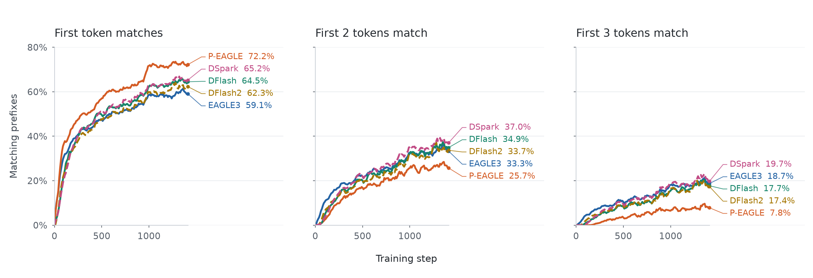
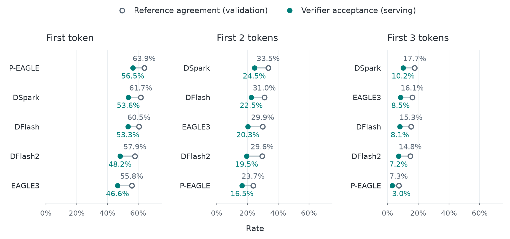

# Training Metrics

`reference_acc_at_pos_i` measures how often all draft tokens through position *i* match the stored continuation. Positions start at 0: position 0 covers the first token, position 1 covers the first two. For example, `[match, mismatch, match]` succeeds at position 0 and fails at positions 1 and 2.

A start is counted only when every prediction through position *i* is available and all corresponding reference tokens are supervised within the start's non-padding document. Logs include matching (`_sum`) and eligible (`_total`) counts; validation keys add `_epoch`. A zero total means no observations. Checkpoint selection still uses validation loss.

The shared metrics are reported alongside existing drafter-specific metrics. Those diagnostics retain their current definitions; reference agreement is not a numerical replacement for them.

## Example curves

These runs use Qwen3-8B on the `tutorial_regen` split of [inference-optimization/speculators-ci-datasets](https://huggingface.co/datasets/inference-optimization/speculators-ci-datasets) for three epochs. Each panel shows the fraction of eligible starts with a matching prefix, smoothed over five logged steps. Higher is better. Labels show each curve’s final smoothed value.

Sampling and training conditioning differ between drafters, so controlled comparisons need matched starts and settings. These curves measure agreement during training; serving acceptance and speed require separate evaluation.

## Agreement with serving

We evaluated the same five checkpoints with vLLM on [RedHatAI/speculator_benchmarks](https://huggingface.co/datasets/RedHatAI/speculator_benchmarks). Validation reference agreement comes from the dataset used for the training curves above.

`acceptance_at_pos_i` and `reference_acc_at_pos_i` both measure prefixes through zero-based position *i*. Serving counts accepted prefixes over all drafts; validation counts reference matches over eligible starts.

Rows are ordered by validation rate; serving gives the same ordering in each panel. This supports the metric as an ordering signal in this experiment. Absolute rates differ across datasets and settings; these serving runs do not measure training overhead.
