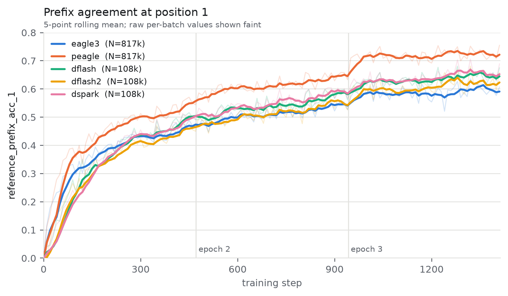
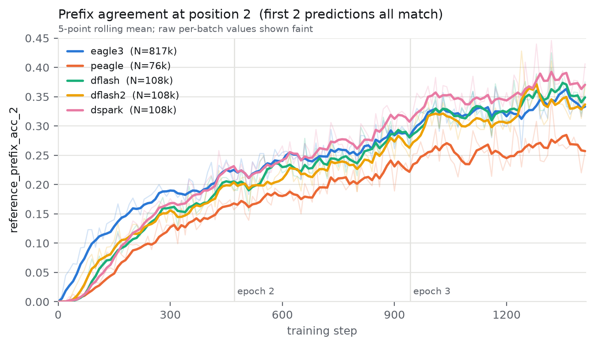
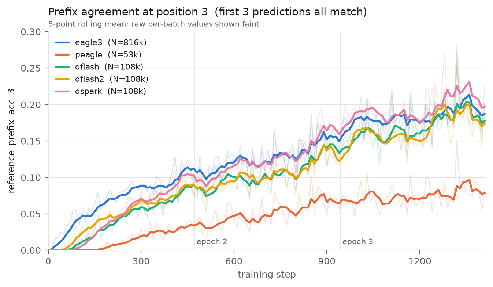

# Training Metrics

All drafters log `reference_prefix_acc_i`: the fraction of starts whose first i predictions all match stored continuation tokens, among starts with all i predictions observed and references supervised within the anchor's non-padding document. `_sum` and `_total` retain pooled matching and eligible counts; validation adds `_epoch`, and zero totals mean no observations. Compare matching positions with the same verifier/tokenizer, data, masks, training progress, and start sampling. Different positions can have different populations, so their rates do not generally sum to a mean prefix length. This diagnostic reuses training predictions without extra teacher or TV computation; serving acceptance requires separate evaluation. It replaces previous training accuracy/length counters; checkpoint selection still uses validation loss.

## What the curves look like

The figures below plot `reference_prefix_acc_i` against training step for the drafters
that can share one verifier and one hidden-state cache. They are here to show how the
metric behaves during training -- monotone improvement, and a strictly lower rate at each
deeper position -- not to rank the algorithms.

Every run used identical arguments apart from `--speculator-type`: Qwen3-8B verifier,
`tutorial_regen` (4993 rows, 15,105,094 tokens), offline hidden states, 3 epochs,
`--lr 3e-4 --total-seq-len 8192 --seed 42`, four H100s. No `--draft-vocab-size` was
passed, so every drafter used the full 151936 verifier vocabulary; no
`--target-layer-ids` was passed, so every drafter used the default `[2, n//2, n-3]`.

Validation rates after the third epoch, with the eligible-start count behind each rate:

| drafter | acc_1 | N_1  | acc_2 | N_2  | acc_3 | N_3  |
| ------- | ----- | ---- | ----- | ---- | ----- | ---- |
| eagle3  | 0.558 | 817k | 0.299 | 817k | 0.161 | 816k |
| peagle  | 0.639 | 817k | 0.237 | 76k  | 0.073 | 53k  |
| dflash  | 0.605 | 108k | 0.310 | 108k | 0.153 | 108k |
| dflash2 | 0.579 | 108k | 0.296 | 108k | 0.148 | 108k |
| dspark  | 0.617 | 108k | 0.335 | 108k | 0.177 | 108k |

### Reading these curves

The counts are part of the reading, which is why they are logged and shown. Three
differences matter here and none of them is a property of the metric:

- **Eligible populations differ between drafters.** The DFlash family samples anchors
  (`--max-anchors`, 512 by default), so it observes roughly 108k starts per validation
  epoch against EAGLE3's 817k. Anchors are drawn uniformly at random from supervised
  positions, so the rates remain comparable in expectation; the smaller sample is noisier,
  not biased.
- **Eligible populations can differ between positions of the same drafter.** P-EAGLE
  samples depths, so its position 2 and 3 rates rest on 76k and 53k starts against 817k at
  position 1. Its deeper positions are measured on a different, much smaller population
  than its own first position.
- **The same position is a different prediction problem.** EAGLE3's position *i* is the
  *i*-th autoregressive test-time-training step conditioned on its own previous draft;
  DFlash's is the *i*-th parallel mask slot inside one block. The metric definition is
  shared; the task being measured is not.

Positions 1 to 3 are shown because that is the deepest position every drafter reports at
its defaults: EAGLE3 reports `--ttt-steps` (3) positions, MTP `--num-speculative-steps`
(3), DFlash2 `--block-size` minus one (7), DSpark `--block-size` (8), P-EAGLE
`--num-depths` (8), and DFlash `--block-size` minus one (15).

MTP is absent because it cannot share this setup: it extracts native `mtp.` layers from
the verifier checkpoint, which Qwen3-8B does not have, and a different verifier would
break the matched-verifier condition this metric requires.
