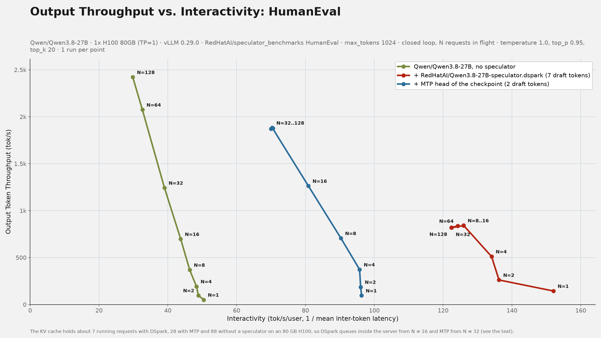
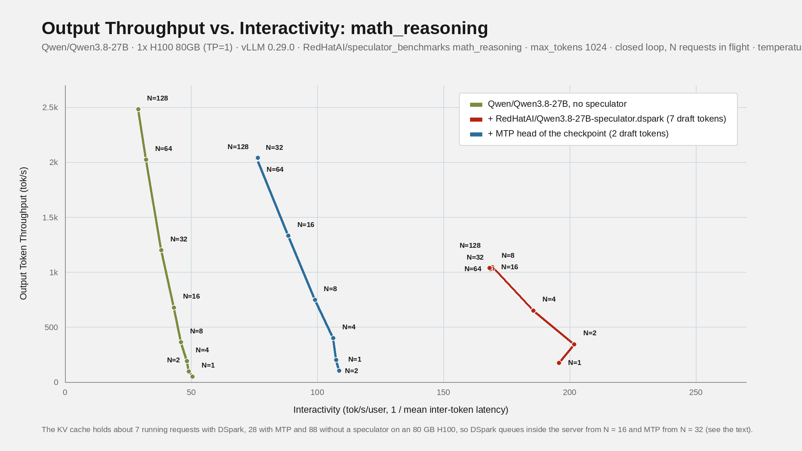

# Throughput vs. Interactivity

This tutorial shows how to measure what a speculator buys in production terms: how many output tokens a GPU produces per second (throughput) against how fast each user receives them (interactivity), over the whole range of load. It is the chart SemiAnalysis publishes for every GPU on [InferenceX](https://inferencex.semianalysis.com), produced here for a vLLM server with one or more speculators, on real prompts.

The tool is one helper script, `scripts/evaluate/throughput_interactivity.py`, with four subcommands: `collect` runs the sweep with [GuideLLM](https://github.com/vllm-project/guidellm), `parse` turns the raw results into a CSV, `validate` checks the sweep for the usual ways a benchmark lies, and `plot` draws the chart. It complements [Evaluating Model Performance](evaluating_performance.md): that page measures acceptance rates and latency against request rate; this one measures the throughput and per-user speed trade-off at fixed concurrency, the way InferenceX does.

## What the chart shows

Each point is one load level. For every point the script measures, over a window after a warmup:

- **y axis, output token throughput (tok/s):** output tokens the server generated inside the window, divided by the window length. All requests that overlap the window count, including those still running when it ends; a request's tokens are spread evenly between its first and last token, and only the part inside the window counts.
- **x axis, interactivity (tok/s/user):** 1000 divided by the mean inter-token latency in milliseconds, over the requests that completed inside the window. This is the decode speed one user sees once tokens are flowing. GuideLLM's `inter_token_latency_ms` is `(last token - first token) / (output tokens - 1)`, the same formula as InferenceX's TPOT, so the numbers are comparable with the InferenceX dashboard. Queue wait and time to first token are reported separately.

Moving left along a curve means more concurrent requests: total throughput rises and each user's stream slows down, because every decode step streams the full weights through HBM whether the batch holds 1 sequence or 128. Speculative decoding changes the shape of the curve: a step now emits several tokens, so at low concurrency each user gets tokens much faster, and at high concurrency, where the GPU is already busy, the gain shrinks. Comparing the curves at equal throughput, or at equal interactivity, is the honest way to read what a speculator delivers.

The CSV also carries a second definition, `interactivity_tps_user = throughput / mean requests in flight` (Little's law), which counts queue wait and TTFT against the user. `plot --x little` draws it. Below capacity the two agree within a few percent.

## How a sweep runs

`collect` runs one GuideLLM benchmark per point and repeat:

1. **Load model.** Closed loop, as InferenceX: `--streams 1,2,4,8,...` keeps exactly N requests in flight, and each stream sends its next request the moment the previous one completes. N, streams, requests in flight and concurrency are the same number on this page. Concurrency is the knob, the server is never over-queued, and the sweep can go as deep into saturation as `max-num-seqs` allows.
2. **Warmup and window.** Each point runs for `--warmup-seconds` plus `--max-seconds`. The parser counts only what happened inside the window: throughput and concurrency are prorated to it, and ITL, TTFT and output lengths come from the requests that completed inside it (GuideLLM's own request lists also hold the ones that finished during warmup). So cold start and the ramp-up of the batch are not in the numbers. Make the window several request lifetimes long; `validate` tells you when it was too short.
3. **Server metrics.** During every run the script samples the server's `/metrics` every 2 seconds and stores, in a sidecar file next to the raw JSON, the speculative-decoding acceptance between the samples nearest the window's start and end (`num_drafts`, accepted tokens, acceptance length, which is the accepted draft tokens per step plus one, i.e. the tokens emitted per verifier step, and per-position acceptance), so warmup is not in it either. The CSV carries `acceptance_length` per point, so you can see acceptance fall or hold as concurrency grows. The same samples give the mean number of requests running and waiting inside vLLM over the window (`mean_running_requests`, `mean_waiting_requests`, with `mean_kv_cache_usage`), which check 4 uses to tell a queue inside the server from a slow client. It also records `mean_output_tokens_per_iteration`, the tokens per streamed chunk seen by the client, as a cross-check.
4. **Provenance.** `bench_command.txt` in the output directory gets one block per `collect` invocation with the timestamp, full command, git SHA, GuideLLM, vLLM and speculators versions, and the server's `/version` and `/v1/models` responses.

Existing results are skipped unless `--overwrite`, so a sweep can be resumed or extended into the same directory, and the CSV is rebuilt from every JSON found there.

## What is supported

Real prompts only: a subset of `RedHatAI/speculator_benchmarks` (`--subset HumanEval --max-tokens 1024`), or any local directory or `.jsonl` file given as `--dataset`, with `--prompt-column` naming the column. The subset is fetched once, repeated enough times for the sweep (GuideLLM stops when a dataset runs out), shuffled with a fixed seed and written under `<out-dir>/_data/`, and sent through `/v1/chat/completions`.

Random text (GuideLLM's synthetic data) is deliberately not offered: a drafter has nothing to predict in it, so it says nothing about a speculator, and GuideLLM would replay the same seeded prompts to the server on every run.

The server must be vLLM, since the acceptance counters and the prefix-caching check come from its `/metrics`. Requests carry no sampling parameters unless `--extra-body` adds them (`--extra-body temperature=0` for greedy decoding), so by default the server's own defaults apply, which for vLLM come from the model's `generation_config.json`; acceptance length depends on them, so keep them identical across the configurations you compare and name them in the chart's subtitle. GuideLLM 0.8.0 or newer is recommended and is what the script was tested with. Prefix caching must be off on the server, since the prompts repeat: `collect` reads the setting from vLLM's `/metrics` and refuses to start while it is on.

## Run the example

`examples/evaluate/example_qwen3_8_27b_dspark_throughput_interactivity.sh` benchmarks `Qwen/Qwen3.8-27B` alone, with its DSpark speculator [`RedHatAI/Qwen3.8-27B-speculator.dspark`](https://huggingface.co/RedHatAI/Qwen3.8-27B-speculator.dspark) (7 draft tokens), and with its MTP head, the multi-token-prediction head shipped in the checkpoint (2 draft tokens; the head has one layer, so vLLM's own default would be 1, and the vLLM recipe for this model suggests 3, so treat the count as a knob), on the HumanEval and math_reasoning subsets of `RedHatAI/speculator_benchmarks`:

```bash
pip install "guidellm>=0.8.0" pillow
CUDA_VISIBLE_DEVICES=0 bash examples/evaluate/example_qwen3_8_27b_dspark_throughput_interactivity.sh
```

It launches vLLM for each configuration, sweeps N = 1 to 128 on each dataset, stops the server, and draws one chart per dataset. The sections below were produced by exactly this procedure.

## Run it by hand

1. Serve each configuration in turn with identical flags apart from `--speculative-config`: the plain model (omit the flag), DSpark (below), and MTP (`--speculative-config '{"method":"mtp","num_speculative_tokens":2}'`). Turn prefix caching off: the repeated prompts would otherwise be prefilled from cache, and `collect` refuses to run against a server that has it on. Serve on one GPU, as the model would be deployed in production, not on every GPU in the box.

   ```bash
   vllm serve Qwen/Qwen3.8-27B --port 8010 --max-model-len 16384 \
     --max-num-seqs 256 --max-num-batched-tokens 16384 \
     --no-enable-prefix-caching \
     --speculative-config '{"model":"RedHatAI/Qwen3.8-27B-speculator.dspark","num_speculative_tokens":7,"method":"dspark"}'
   ```

2. Collect one sweep per server configuration, each into its own `--out-dir` and with its own `--label` (`baseline`, `dspark`, `mtp`). Use `--dry-run` first to see the GuideLLM commands. Points whose JSON already exists are skipped, so the short-window and long-window runs below go into the same directory and the CSV is rebuilt from all of them.

   ```bash
   python scripts/evaluate/throughput_interactivity.py collect \
     --target http://localhost:8010 --model Qwen/Qwen3.8-27B \
     --subset HumanEval --max-tokens 1024 \
     --streams 1,2,4,8,16 --max-seconds 90 --warmup-seconds 30 --repeats 3 \
     --out-dir runs/dspark_humaneval --label dspark --csv dspark_humaneval.csv --keep-going
   python scripts/evaluate/throughput_interactivity.py collect \
     --target http://localhost:8010 --model Qwen/Qwen3.8-27B \
     --subset HumanEval --max-tokens 1024 \
     --streams 32,64,128 --max-seconds 120 --warmup-seconds 60 --repeats 3 \
     --out-dir runs/dspark_humaneval --label dspark --csv dspark_humaneval.csv --keep-going
   ```

   The high-N points (32 and up) get the longer warmup and window because their requests take tens of seconds. To change a point that already ran, pass `--overwrite`.

3. Validate before you believe it:

   ```bash
   python scripts/evaluate/throughput_interactivity.py validate dspark_humaneval.csv
   ```

4. Plot the configurations you want to compare:

   ```bash
   python scripts/evaluate/throughput_interactivity.py plot \
     --series baseline_humaneval.csv:'no speculator':'#7a8c3f' \
     --series dspark_humaneval.csv:'dspark, 7 draft tokens':'#b52513' \
     --series mtp_humaneval.csv:'MTP head, 2 draft tokens':'#2c6e9b' \
     --title 'Qwen3.8-27B, HumanEval' --subtitle '1x B200, vLLM 0.30, max_tokens 1024' \
     --out humaneval.png
   ```

## Read the validation report

`validate` prints one row per point (N, throughput, concurrency, both interactivity definitions, ITL, TTFT, requests waiting inside the server, acceptance length, and the spread across repeats) and warns about four known problems. Each of them produced a wrong chart at least once:

1. **A run ended on `requests_exhausted`:** the dataset ran out; set `--dataset-repeat` higher than the automatic choice (20 requests per stream, at least 5,000 requests).
2. **Tokens per completed request do not match the output length:** the window was too short for steady state; lengthen the warmup and the window.
3. **Repeats disagree by more than 5%:** differences smaller than that are noise.
4. **Points queue inside the server:** more streams than the server can hold wait inside vLLM, so TTFT jumps while ITL does not. The cause is the batch cap (`max-num-seqs`) or a full KV cache; raise the cap, free KV cache memory, or stop the sweep below that N. `mean_waiting_requests`, vLLM's waiting gauge averaged over the window, confirms that the queue is inside the server; when it is zero the check says so and points at the API server, the client or the host instead.

## Choosing N and windows

- Keep every server flag identical apart from the drafter, and serve with `--no-enable-prefix-caching` (`collect` refuses to run otherwise). One GPU per server, sized the way the model is deployed in production (`TP=1` for a 27B dense model); running the configurations on separate GPUs of one host at the same time is fine, spreading one server over every free GPU is not, because it measures a deployment nobody runs.
- Pin the server's scheduler limits and set the batch cap at or above the largest N: `--max-num-seqs 256 --max-num-batched-tokens 16384` for a sweep to N = 128. Left unset, vLLM derives them from GPU memory (`max-num-seqs` 256 to 1,024, batched tokens 2,048 to 16,384), so the same script measures a different scheduler on a different host. InferenceX pins the batch size in every recipe, usually at or above the concurrency of the point, with a large chunked-prefill budget. Raise the cap if you want the left end of the curve to show the GPU rather than one configuration. When the cap is above N and check 4 still fires, the KV cache is the usual limit: the CSV's `mean_running_requests`, `mean_waiting_requests` and `mean_kv_cache_usage` columns (vLLM's gauges, sampled while the point runs) show how many requests the server held and how many waited. In the example, the DSpark server held about 74 running requests on one B200 before queueing. With speculative decoding on a hybrid model (linear-attention or Mamba layers), vLLM keeps one copy of the recurrent state per draft token so it can roll back rejected drafts, so the KV cost of a request grows with `num_speculative_tokens`; the same DSpark server holds about 7 requests on an 80 GB H100 (see below).
- A smaller `--max-num-batched-tokens` gives better ITL, because fewer prefill tokens interrupt decode steps; a larger one gives better TTFT and throughput. vLLM's tuning guide recommends above 8,192 for throughput.
- At 1,024 output tokens, a request takes a few seconds at N = 1 and tens of seconds at N = 128, so the high-N points need a 60 s warmup and a 120 s window or more.
- Run the configurations one at a time on a quiet machine, keep the server flags identical apart from the speculator, and repeat every point before quoting a difference of a few percent.
- Check that the GPU holds its clocks. A thermally throttling GPU runs the same batch with the same acceptance length at half the speed, which looks exactly like a regression in the server or the drafter; `nvidia-smi --query-gpu=temperature.gpu,clocks.sm,clocks_throttle_reasons.active --format=csv` during a point, and `mean_running_requests` against the throughput of an earlier run, tell the two apart.

## What the example produces

Two charts, one per dataset, with the plain model, the DSpark speculator (7 draft tokens) and the checkpoint's MTP head (2 draft tokens). These were measured on one B200 per server with vLLM 0.30.1rc1 and GuideLLM 0.8.0, one run per point, before the example turned off prefix caching, so their prefill was partly served from cache; your numbers will differ with hardware, vLLM version and server flags, which is why the example records all of them in `bench_command.txt` and the serve logs.


How to read them: at one request in flight, DSpark gives each user about three times the plain model's speed on HumanEval and four times on math_reasoning, in line with its acceptance length; MTP with 2 draft tokens gives about two times. Moving left, every gain shrinks as the verifier batch fills, and the curves cross: with these settings DSpark delivers the most throughput wherever each user must get more than roughly 100 to 125 tok/s, while MTP's cheaper drafts deliver the most output per GPU at lower per-user speeds and never queue. Pick the per-user speed you must guarantee, read the throughput each configuration gives at it, and that is the comparison that matters for a deployment. `validate` flagged DSpark's N = 128 points as queueing inside the server: with the drafter loaded, the KV cache on one B200 held about 74 requests, so that point measures queueing plus decode.

### The same three configurations on an H100

The same procedure on one H100 80GB per server, with vLLM 0.29.0 and GuideLLM 0.8.0, prefix caching off, one run per point, and every request sent with the model's default sampling (temperature 1.0, top-p 0.95, top-k 20, the values in its `generation_config.json`, passed with `--extra-body` so that all three servers see the same):





At one request in flight the picture matches the B200: DSpark gives each user 3.0 times the plain model's speed on HumanEval and 3.9 times on math_reasoning, MTP with 2 draft tokens 2.0 and 2.1 times. The right side of the chart is different, and the cause is the KV cache, not the drafter. Qwen3.8-27B is a hybrid model whose 48 linear-attention layers keep about 160 MB of recurrent state per request, and vLLM holds one copy of that state per draft token so it can roll back rejected drafts (`1 + num_speculative_tokens` copies). A request therefore costs about 0.2 GB of KV cache without a speculator, 0.55 GB with MTP and 1.4 GB with DSpark. After the weights, an 80 GB H100 leaves 17 GiB of KV cache to the plain server, 15 GiB to MTP and 10 GiB to DSpark, so the three servers hold about 88, 28 and 7 running requests. Past that, `validate` reports check 4 (DSpark from N = 16, MTP from N = 32, the plain server at N = 128): throughput plateaus at about 1,000 tok/s for DSpark and 1,900 for MTP while the ITL-based interactivity stays flat, because once a request streams it is measured like any other, and `plot --x little` shows the same points with the queue wait counted against the user. On a B200 the same per-request cost leaves room for about 73 DSpark requests, which is why only its N = 128 point queued there. Both runs say the same thing about the drafters; the H100 run also says how much memory each configuration needs before concurrency, not the drafter, sets the throughput.

See [throughput_interactivity.py](../../cli/throughput_interactivity.md) for the full command-line reference and the CSV columns.
