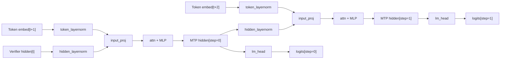

# FastMTP — Multi-Token Prediction Finetuning

This example shows how to finetune a [Qwen3-Next](https://huggingface.co/Qwen/Qwen3-Next-80B-A3B-Instruct/tree/main) MTP head on [HuggingFaceH4/ultrachat_200k](https://huggingface.co/datasets/HuggingFaceH4/ultrachat_200k).

## Overview

FastMTP is a speculative decoding algorithm from TencentBAC, adopted in [Qwen3-Next](https://huggingface.co/Qwen/Qwen3-Next-80B-A3B-Instruct/tree/main). FastMTP applies a **single MTP layer recursively**: at step k, the layer receives the token embedding for `input_ids[t+k+1]` and the hidden state output from step k-1. Each step predicts token `t+k+2`.

**Architecture:**



**Training objective** (from the FastMTP paper):

$$\\mathcal{L}_{\\text{mtp}} = \\sum_{k=0}^{K-1} \\alpha_k \\cdot \\text{CE}(\\text{logits}_k,\\ \\text{tokens}_{t+k+2})$$

Default weights $\\alpha = [0.51, 0.31, 0.18]$ use exponential decay ($\\beta=0.6$, normalized). Loss is computed only on response tokens via `loss_mask`.

## Convert a Checkpoint

Edit the constants at the top of `examples/fast_mtp/convert_qwen3_next.py` (`MODEL`, `OUTPUT`, `NUM_STEPS`) and run:

```bash
python examples/fast_mtp/convert_qwen3_next.py
```

Or use the `speculators convert` CLI directly:

```bash
speculators convert Qwen/Qwen3-Next-80B-A3B-Instruct \
    --algorithm mtp \
    --verifier  Qwen/Qwen3-Next-80B-A3B-Instruct \
    --output-path ./qwen3_next_mtp_speculators
```

## Supported Checkpoints

| Model                                                                           | model_type   |
| ------------------------------------------------------------------------------- | ------------ |
| [Qwen3-Next](https://huggingface.co/Qwen/Qwen3-Next-80B-A3B-Instruct/tree/main) | `qwen3_next` |

## Paper

Cai et al., [FastMTP: Accelerating LLM Inference with Enhanced Multi-Token Prediction](https://arxiv.org/abs/2509.18362), arXiv:2509.18362, 2025.

```bibtex
@article{cai2025fastmtp,
  title={FastMTP: Accelerating LLM Inference with Enhanced Multi-Token Prediction},
  author={Cai, Yuxuan and Liang, Xiaozhuan and Wang, Xinghua and Ma, Jin and Liang, Haijin and Luo, Jinwen and Zuo, Xinyu and Duan, Lisheng and Yin, Yuyang and Chen, Xi},
  journal={arXiv preprint arXiv:2509.18362},
  year={2025}
}
```
